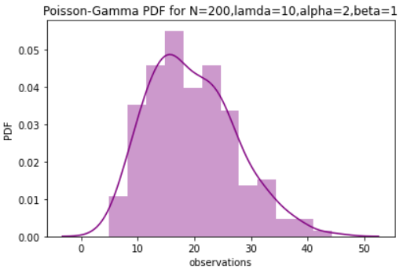
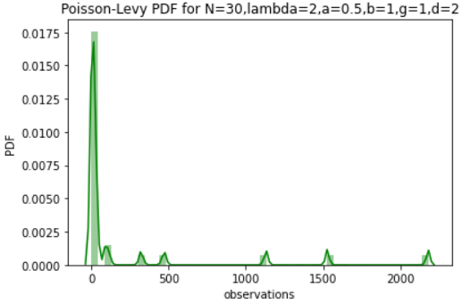
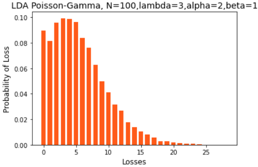

# Quantitative_Modelling_of_OpRisk_and_Insurance_Analytics
STAT0020 Module @UCL
✨ Loss Distribution Approach (LDA)  
✨ Monte Carlo Simulations  
✨ Modelling insurance losses/claims  
✨ Analyzing frequency and severity of losses  

An example of LDA with Poisson frequency- Gamma severity is the following:  
 

  

 
An example of LDA with Poisson frequency- Stable (Levy) severity is the following:  
 

  

 
An example of Monte Carlo Convolution is the following:  
 

  

